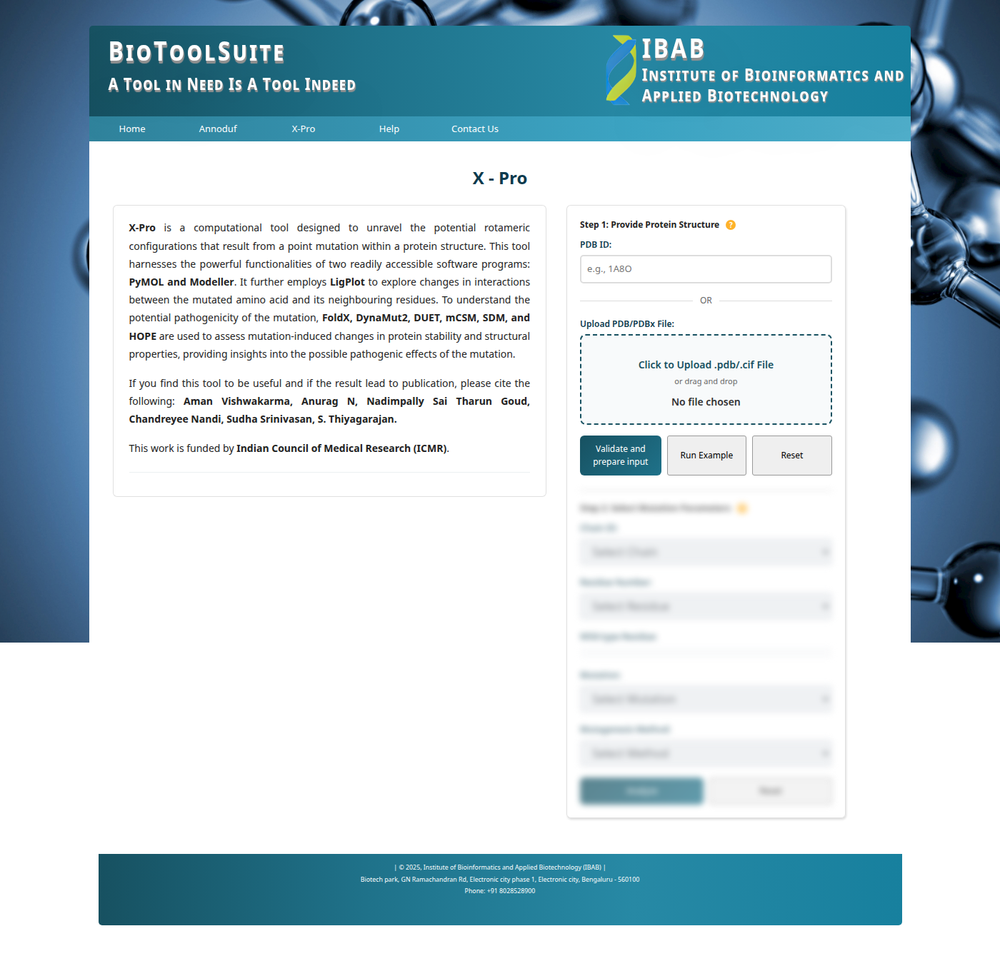
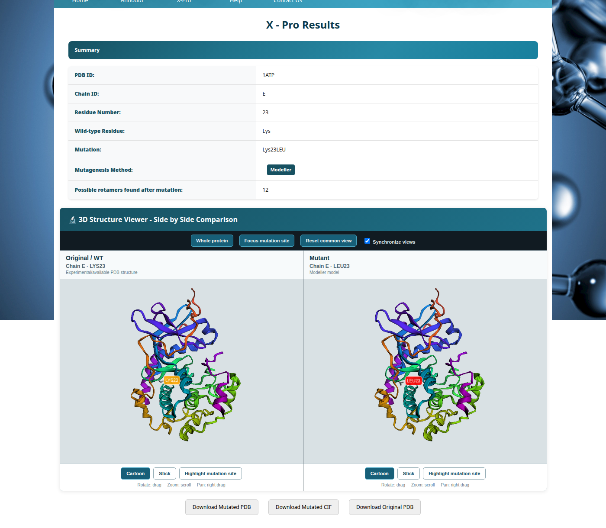
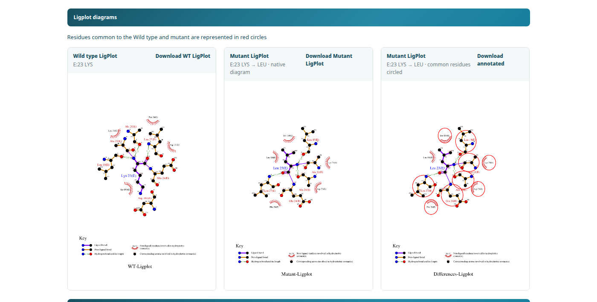
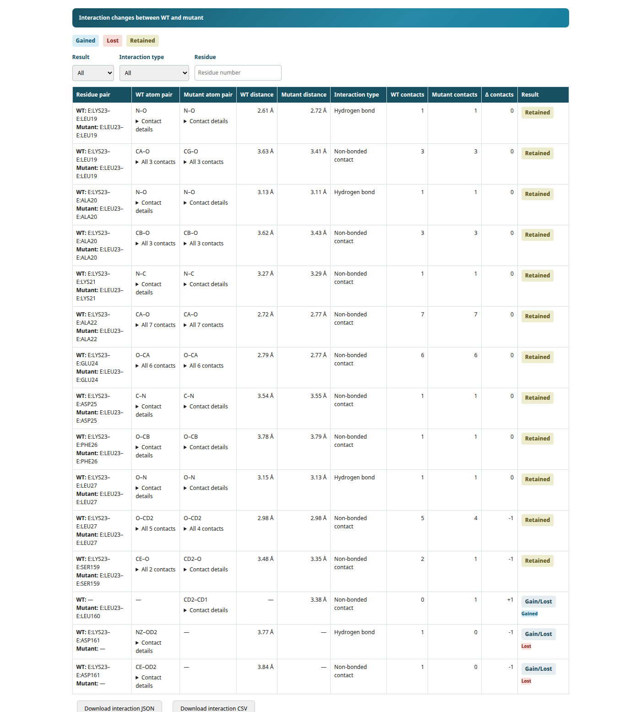
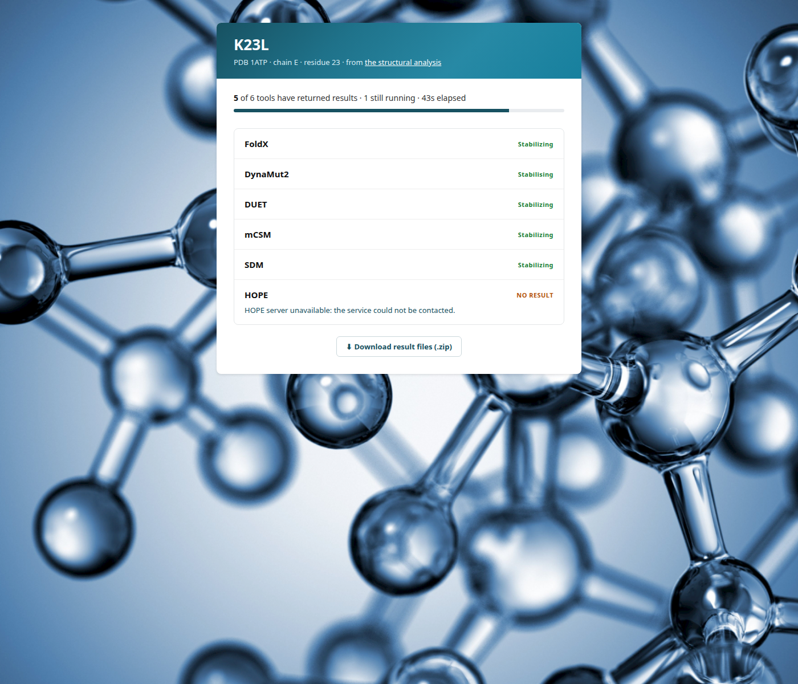

# X-Pro

**X-Pro** is a web-based computational tool for structural analysis of point mutations in proteins. It identifies potential rotameric configurations, detects interaction gains and losses at the mutation site, and integrates multiple stability predictors — all through a streamlined web interface.

**Live server:** [https://bts.ibab.ac.in/X-Pro.php](https://bts.ibab.ac.in/X-Pro.php)

---

## Overview

Point mutations in proteins can alter residue geometry, disrupt hydrogen bonds, eliminate hydrophobic contacts, and affect overall stability. X-Pro automates this structural investigation by:

- Generating the mutant structure using **PyMOL** (mutagenesis wizard) or **Modeller** (recommended)
- Identifying all low-energy rotamers for the mutant residue
- Running **LigPlot+** on both wild-type and mutant structures to map interaction networks
- Comparing pre- and post-mutation interactions (hydrogen bonds, non-bonded contacts)
- Querying external stability predictors: **FoldX**, **DynaMut2**, **DUET**, **mCSM**, **SDM**, and **HOPE**
- Presenting results as tables, diagrams, and downloadable structure files

---

## Features

| Feature | Details |
|---|---|
| Structure input | PDB ID (auto-fetch from RCSB) or direct `.pdb` / `.cif` file upload |
| Mutagenesis engines | PyMOL mutagenesis wizard · Modeller comparative modelling |
| Rotamer analysis | All low-energy rotamers enumerated and listed |
| Interaction analysis | LigPlot+ for pre/post-mutation hydrogen bonds and hydrophobic contacts |
| Stability prediction | FoldX · DynaMut2 · DUET · mCSM · SDM · HOPE |
| Visualisation | PyMOL-rendered PNG images of wild-type and mutant structures |
| Output formats | Tabular interaction summary · downloadable mutant PDB · PNG images |
| Web interface | PHP + Bootstrap 4 — no client-side installation required |

---

## Workflow

### Step 1 — Submit a protein structure and mutation

The homepage presents two panels: **Step 1** (structure input) and **Step 2** (mutation parameters, enabled after validation).

- Enter a **PDB ID** to auto-fetch from the RCSB Protein Data Bank, or click **"Click to Upload .pdb/.cif File"** to supply a local structure file.
- Click **"Validate and Prepare Input"** — the structure is downloaded and the Step 2 fields populate automatically.
- Select the **Chain ID**, **Residue Number** (wild-type residue name is shown automatically), target **Mutation**, and **Mutagenesis Method** (PyMOL or Modeller — Modeller recommended).
- Click **"Analyze"** to submit the job.

Use **"Run Example"** to instantly view a pre-computed result, or **"Reset"** to clear all fields.



---

### Step 2 — Mutation analysis results

On job completion, the result page shows three sections:

**Summary table** — PDB ID, Chain, Residue Number, Wild-type Residue, Mutation, Mutagenesis Method, and the number of low-energy rotamers enumerated for the mutant residue.

**3D Structure Viewer** — Side-by-side PyMOL-rendered comparison of the original (WT) and mutant structures at the mutation site. Controls allow switching views, highlighting mutation sites, and downloading original or mutated PDB files.

**LigPlot+ diagrams** — Three 2D interaction diagrams generated by LigPlot+:
- **Wild type LigPlot** — interaction network around the original residue (hydrogen bonds, hydrophobic contacts)
- **Mutant LigPlot (native)** — interaction network around the substituted residue
- **Mutant LigPlot (common residues circled)** — mutant diagram with residues shared between WT and mutant highlighted in red circles for direct comparison

Each diagram can be downloaded individually.





---

### Step 3 — Interaction changes table

Below the LigPlot diagrams, a filterable **Interaction Changes** table lists every residue pair and its bond-level detail across both structures. Each row shows the residue pair, WT and mutant atom names, distances, interaction type, contact counts, and a **Gained / Lost / Retained** status badge.

Filter controls allow narrowing by status (Gained, Lost, Retained) and by interaction type (hydrogen bond, non-bonded contact). Download buttons export the full table as **JSON** or **CSV**.



---

### Step 4 — Pathogenicity predictions

A link on the result page opens the **Pathogenicity Predictions** page, which queries six external stability and effect predictors in parallel:

| Tool | Prediction type |
|---|---|
| FoldX | ΔΔG free energy of folding change |
| DynaMut2 | Stability and flexibility change |
| DUET | Integrated stability prediction |
| mCSM | Graph-based mutation signatures |
| SDM | Statistical stability prediction |
| HOPE | Structural effect annotation |

Results load progressively as each tool responds. A progress bar tracks completion. All available results can be downloaded as a ZIP archive.



---

## Installation

### Requirements

| Component | Version |
|---|---|
| Apache | 2.4+ |
| PHP | 7.4+ |
| Python | 3.8+ |
| Java | 11+ (for LigPlot+) |
| MySQL / MariaDB | 5.7+ |
| PyMOL (open-source) | 2.x |
| Modeller *(optional)* | 10.x |

### 1. Clone the repository

```bash
git clone https://github.com/BTST-IBAB/X-Pro.git
cd X-Pro
```

### 2. Deploy to web root

```bash
sudo cp -r . /var/www/html/
```

### 3. Configure the database

Edit `connect.php` and fill in your MySQL credentials:

```php
$servername = "localhost";
$username   = "your_db_user";
$password   = "your_db_password";
$dbname     = "your_db_name";
```

### 4. Install Python dependencies

```bash
pip3 install biopython requests pymol-open-source
# If using Modeller:
# Follow https://salilab.org/modeller/download_installation.html
```

### 5. Download external binaries

The following large binaries must be downloaded separately and placed at the paths below:

| Binary | Path | Source |
|---|---|---|
| FoldX | `pointMutationScript/foldx` | [https://foldxsuite.crg.eu](https://foldxsuite.crg.eu) |
| LigPlot+ `components.cif` | `pointMutationScript/LigPlus/components.cif` | [https://www.ebi.ac.uk/thornton-srv/software/LigPlus](https://www.ebi.ac.uk/thornton-srv/software/LigPlus) |

### 6. Set permissions

```bash
sudo chmod -R 755 /var/www/html/pointMutationScript/
mkdir -p /var/www/html/fileUpload
sudo chmod 777 /var/www/html/fileUpload/
```

---

## Dependencies

### Python packages

```
biopython
requests
pymol-open-source   # or install PyMOL system-wide
modeller            # optional — required for Modeller mutagenesis method
```

### External tools integrated via API / web

| Tool | Purpose | Reference |
|---|---|---|
| FoldX | Free energy of folding change (ΔΔG) | Delgado et al., 2019 |
| DynaMut2 | Stability and flexibility change | Rodrigues et al., 2021 |
| DUET | Integrated stability prediction | Pires et al., 2014 |
| mCSM | Graph-based mutation signatures | Pires et al., 2014 |
| SDM | Stability change prediction | Pandurangan et al., 2017 |
| HOPE | Structural effect annotation | Venselaar et al., 2010 |

---

## Directory Structure

```
X-Pro/
├── X-Pro.php                       # Main submission page
├── X-ProResult.php                 # Results display page
├── X-Pro_Example.php               # Pre-loaded example analysis (1BBT, Thr60Met)
├── X-Pro-Progress.php              # Job progress polling
├── comparison_helpers.php          # Interaction comparison utilities
├── xpro_to_mutxplor.php            # Export bridge to MutXplor
├── header.php / footer.php         # Shared layout
├── connect.php                     # Database configuration (edit before deploy)
├── headerStyle.css                 # Navigation and banner styles
├── mutXplorStyle.css               # Shared table styles
├── .htaccess                       # Apache URL configuration
├── XPro_Tool_Citations.bib         # BibTeX citations for integrated tools
│
├── pointMutationScript/
│   ├── xpro.py                     # Main orchestration script
│   ├── point_mutator.py            # PyMOL / Modeller mutagenesis
│   ├── automate_point_mutation.py  # Batch mutation driver
│   ├── interaction_comparison.py   # Pre/post interaction diff
│   ├── download_pdbFile.py         # RCSB PDB fetcher
│   ├── structure_alignment.py      # Structure superposition
│   ├── results_assets.py           # Output file generator
│   ├── job_validation.py           # Input validation
│   ├── auto_foldx.py               # FoldX automation
│   ├── auto_duet.py                # DUET web API
│   ├── auto_dynamut2.py            # DynaMut2 web API
│   ├── auto_hope.py                # HOPE web API
│   ├── rotabase.txt                # PyMOL rotamer library
│   └── LigPlus/
│       ├── LigPlus.jar             # LigPlot+ executable
│       ├── lib/                    # LigPlot+ Java libraries (Linux/Mac/Win)
│       └── LigPlus/                # LigPlot+ application data
│
├── css/                            # Stylesheets (Bootstrap 4, DataTables, FontAwesome)
├── js/                             # JavaScript (jQuery, Bootstrap, Highcharts, DataTables)
├── img/
│   ├── X-Pro_help/                 # Workflow screenshots (shown in this README)
│   └── webfonts/                   # FontAwesome web fonts
└── ExampleFolder/
    └── X-Pro/                      # Example output: PDB 1BBT Thr60Met full analysis
```

---

## Example Analysis

The built-in example (click **Run Example** on the homepage) loads a pre-computed analysis so results are visible immediately without waiting for computation.

---

## Output Files

| File | Description |
|---|---|
| `not_mutated.png` | PyMOL image of the wild-type structure |
| `mutated.png` | PyMOL image of the mutant structure |
| `mutated.pdb` | Mutant protein structure (downloadable via "Mutated PDB" button) |
| `*_ligplot.hhb` | LigPlot+ hydrogen bond table (wild-type) |
| `*_ligplot.nnb` | LigPlot+ non-bonded contact table (wild-type) |
| `altered_ligplot.hhb` | LigPlot+ hydrogen bond table (mutant) |
| `altered_ligplot.nnb` | LigPlot+ non-bonded contact table (mutant) |
| `altered_ligplot.png` | LigPlot+ interaction diagram (mutant) |
| `altered_ligplot.csv` | Interaction summary as CSV (downloadable via "Interaction Summary" button) |

---

## Citation

If you use X-Pro in your research, please cite the tool and its integrated components:

**X-Pro**
> Aman Vishwakarma, Anurag N, Nadimpally Sai Tharun Goud, Chandreyee Nandi, Sudha Srinivasan, S. Thiyagarajan.
> *X-Pro: A web-based tool for structural analysis of point mutations.*
> Institute of Bioinformatics and Applied Biotechnology (IBAB), Bengaluru.
> [https://bts.ibab.ac.in/X-Pro.php](https://bts.ibab.ac.in/X-Pro.php)

**Integrated tools** — see [`XPro_Tool_Citations.bib`](XPro_Tool_Citations.bib) for BibTeX entries:

- FoldX — Delgado et al., *Bioinformatics* (2019), doi:[10.1093/bioinformatics/btz184](https://doi.org/10.1093/bioinformatics/btz184)
- DynaMut2 — Rodrigues et al., *Protein Science* (2021), doi:[10.1002/pro.3942](https://doi.org/10.1002/pro.3942)
- DUET — Pires et al., *Nucleic Acids Research* (2014), doi:[10.1093/nar/gku411](https://doi.org/10.1093/nar/gku411)
- mCSM — Pires et al., *Bioinformatics* (2014), doi:[10.1093/bioinformatics/btt691](https://doi.org/10.1093/bioinformatics/btt691)
- SDM — Pandurangan et al., *Nucleic Acids Research* (2017), doi:[10.1093/nar/gkx439](https://doi.org/10.1093/nar/gkx439)
- HOPE — Venselaar et al., *BMC Bioinformatics* (2010), doi:[10.1186/1471-2105-11-548](https://doi.org/10.1186/1471-2105-11-548)

---

## Authors

- Aman Vishwakarma
- Anurag N
- Nadimpally Sai Tharun Goud
- Chandreyee Nandi
- Sudha Srinivasan
- S. Thiyagarajan

**Institution:** Institute of Bioinformatics and Applied Biotechnology (IBAB), Bengaluru, India

**Funding:** Indian Council of Medical Research (ICMR)

---

## License

This software is made available for academic and non-commercial use.
For commercial licensing or collaboration enquiries, contact the authors at IBAB.
